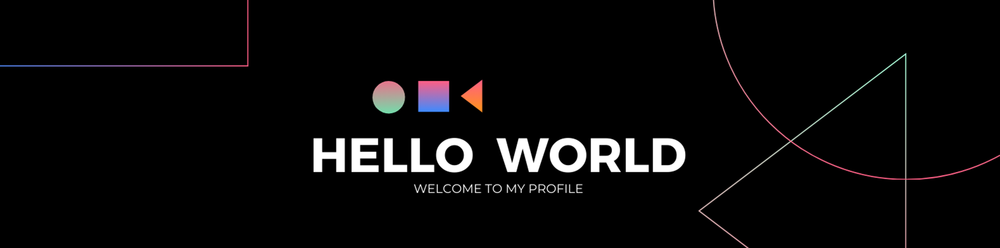

  

<h1 align="center">
  
  I'm Minh
</h1>

<h3 align="center">Software Engineer • AI Agents • Blockchain • Automation</h3>

  

  
  
  
  

  

---

## About Me

I'm **Minh**, a **Software Engineer** with a **solution-centric mindset**.  
Beyond writing code, I focus on **workflow optimization** and building tools that simplify complex tasks, improve efficiency, and enhance productivity.

Currently, I am deeply immersed in researching **AI Agents** and **Blockchain**, driven by the ambition to develop **high-impact, real-world applications**.

  

---

## Work Philosophy

> **If a task is repetitive, it’s a candidate for automation.**

I strive to design and build systems where technology handles the mundane, so humans can focus on creativity, strategy, and meaningful problem-solving.

---

## Tech Stack

  <picture>
    <source media="(prefers-color-scheme: dark)" srcset="./Skills_Animation_Dark.gif">
    <source media="(prefers-color-scheme: light)" srcset="./Skills_Animation_White.gif">
    
  </picture>

---

## GitHub Activity

  

  

---

  <i>Building systems that automate the repetitive, simplify the complex, and empower people to focus on what truly matters.</i>

